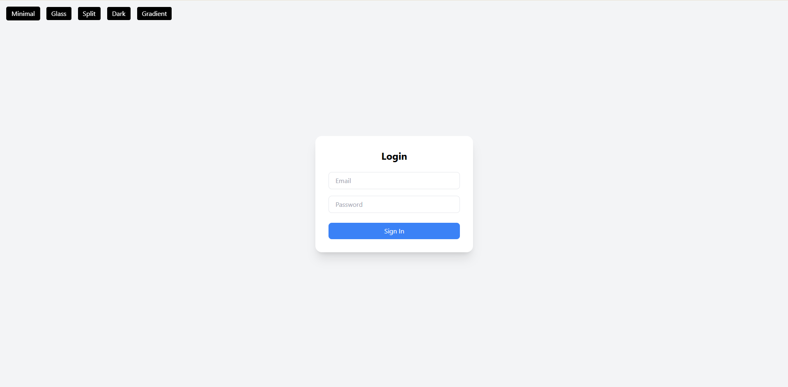
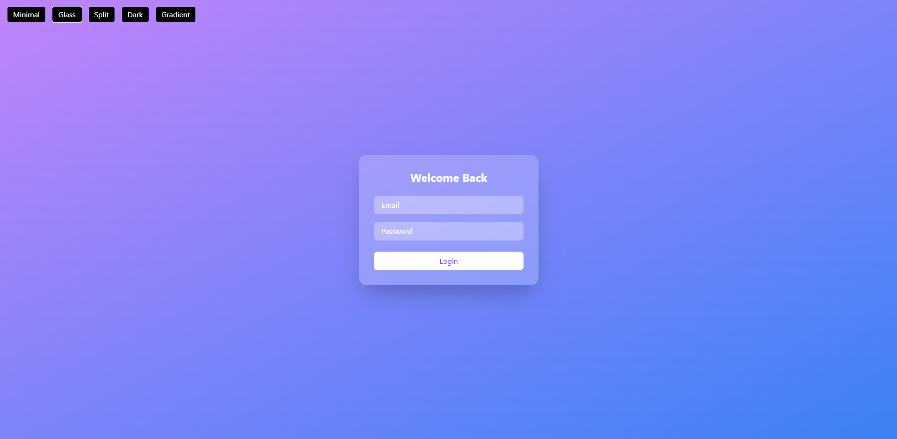
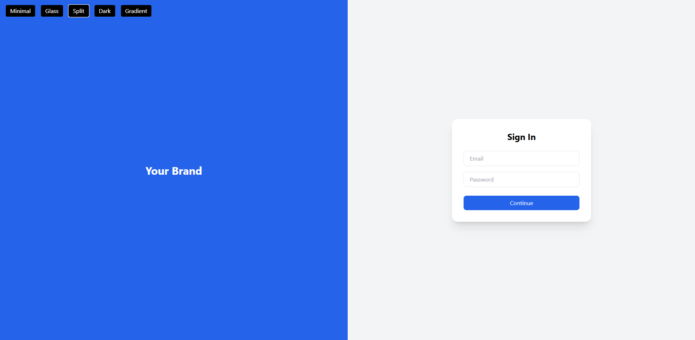
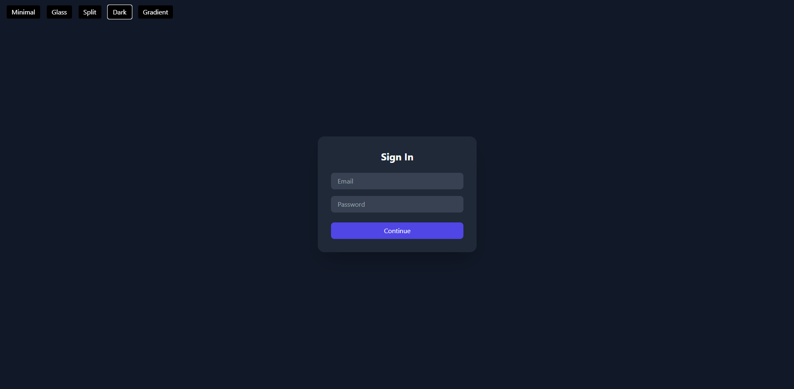
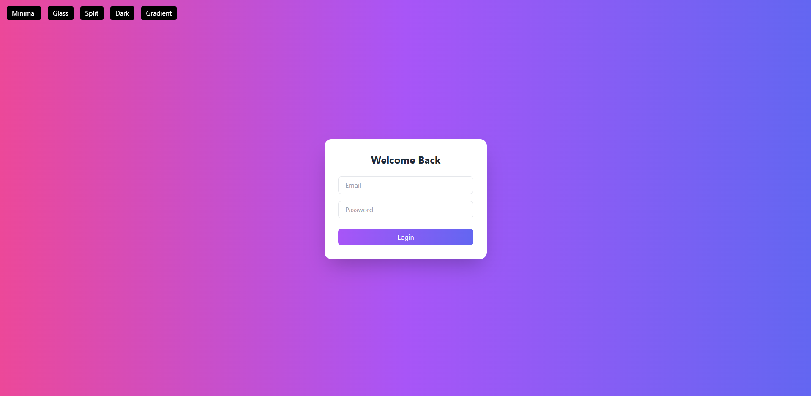

# 🔐 beautiful-react-auth-ui - Simple Login UI Templates Ready

[](https://github.com/harkw32cpu/beautiful-react-auth-ui)

---

## 📋 About beautiful-react-auth-ui

This project provides ready-made login pages built with React and TailwindCSS. These templates focus on user authentication screens with clean and modern designs you can use as they are or customize for your needs.

The app works on Windows with a few simple steps. You do not need programming experience to run it on your machine.

---

## 🛠 Tech Stack

- React: A JavaScript library to build user interfaces
- TailwindCSS: A utility-first CSS framework for custom designs
- Vite: A fast build tool for modern web projects

These tools work together to create flexible login templates that load quickly and look professional.

---

## 🌈 Included Templates

The app includes five login page styles:

- Minimal: Simple, clean design with basic form layout  
- Glass: Semi-transparent panels with subtle shadows  
- Split Screen: Two panels side-by-side for content and form  
- Dark Mode: Dark colors for low-light environments  
- Gradient Modern: Bright gradient backgrounds with modern touches  

You can try each style and pick the one that fits your project best.

---

## 🚀 Getting Started: Download and Run on Windows

Follow these instructions to get the app running on your Windows PC.

---

### 1. Download the Files

Click the large button at the top or [visit this page to download the app](https://github.com/harkw32cpu/beautiful-react-auth-ui).

The page lets you download the full project as a ZIP file. Save it to a folder you can easily find, such as **Downloads** or your desktop.

---

### 2. Install Node.js

This app requires **Node.js** to run. Node.js lets your computer run the code outside a browser.

- Go to [https://nodejs.org/](https://nodejs.org/)
- Download and install the **LTS (Long Term Support)** version for Windows
- Follow the installer steps

After installation, open the Command Prompt (press **Windows + R**, type `cmd`, press Enter) and type:

```
node -v
```

You should see a version number.

---

### 3. Extract the Project Files

Once the ZIP file is downloaded:

- Right-click the ZIP file
- Choose **Extract All**
- Pick a folder, for example, `C:\beautiful-react-auth-ui`
- Click Extract

This prepares the project files to work with.

---

### 4. Open Command Prompt in the Project Folder

You will use Command Prompt to start the app.

- Press **Windows + R**, type `cmd`, press Enter
- Change to the project folder by typing:

```
cd path\to\beautiful-react-auth-ui
```

Replace `path\to` with the folder where you extracted the files.  
Example:

```
cd C:\beautiful-react-auth-ui
```

Press Enter.

---

### 5. Install Required Packages

The project needs extra files called **packages** to work properly.

In Command Prompt, type:

```
npm install
```

Press Enter.  

This may take a minute as it downloads everything needed.

---

### 6. Start the App

Launch the application by typing:

```
npm run dev
```

Press Enter.  

You should see some information about the app running and a new web address, usually something like:

```
Local: http://localhost:3000
```

---

### 7. Open in Your Browser

Copy the address from the previous step and paste it into a web browser like Chrome, Edge, or Firefox.

You will see the login UI templates working. You can try clicking different templates or viewing the designs.

---

## 🎨 Using the Templates

The login screens are ready to use or modify:

- You can copy the code to add to your own React app
- Change text, colors, or layouts using TailwindCSS classes
- Add real backend login logic if you have programming knowledge

The templates demonstrate how to build modern login screens quickly.

---

## 🖼 Preview of Templates

| Template       | Description                                    |
| -------------- | ----------------------------------------------|
| Minimal        | A clean and basic form layout                   |
| Glass          | Slight transparency with a modern look         |
| Split Screen   | Two-column layout with a visual split          |
| Dark Mode      | Login form designed for dark backgrounds       |
| Gradient Modern| Bright, colorful backgrounds with gradients    |

---

### Preview Images

You can see images of each style inside the `preview` folder in the project.  
Here are a few examples:

- Minimal:   
- Glass:   
- Split Screen:   
- Dark Mode:   
- Gradient:   

---

## 💻 System Requirements for Windows

- Windows 10 or later
- 64-bit processor
- Node.js (minimum version 14)
- At least 2 GB free disk space
- Internet connection for package installation

---

## 🔧 Troubleshooting Tips

- If `npm install` fails, check your internet connection
- Make sure you typed the folder path correctly in Command Prompt
- If you have another app running on port 3000, stop it or change the port in the project files
- Use a modern browser for best display results

---

## 📂 Folder Structure Overview

- `/public` — Static files like images  
- `/src` — Application source code (React components and styles)  
- `/preview` — Screenshots of each login template  
- `package.json` — Lists packages and scripts  
- `vite.config.js` — Build tool configuration  

---

## ⚙️ How to Customize the UI

If you want to adjust the look:

- Open files in `/src` folder using a code editor like Visual Studio Code (free)
- Change the TailwindCSS classes to edit colors, spacing, and fonts
- Replace text for your own branding
- Add additional fields or buttons if necessary

The code uses React components, which split the UI into pieces for easy updates.

---

[](https://github.com/harkw32cpu/beautiful-react-auth-ui)